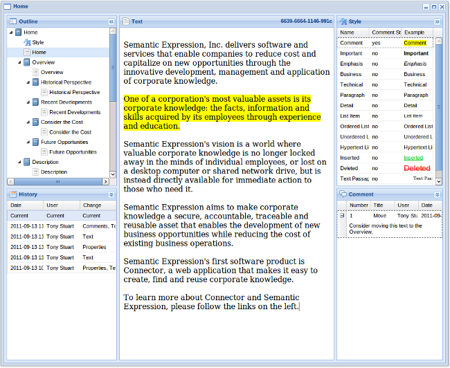
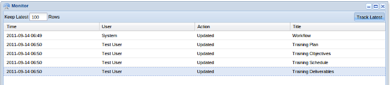

# Overview

Connector is a collaborative web application for sharing and reusing information. It breaks content into blocks that are easy to find and reuse. Blocks can be linked or copied to create new blocks. Each block has a history that includes author, date and change, as well as past and subsequent use. Blocks can contain other blocks.

Blocks consist of text, images, tables, charts, stylesheets and workflows. Blocks can be organized into collections using public or private tags. Connector provides a multi-faceted search capability that includes full text, structured and tag based searches, plus a drag and drop editor that makes it easy to create and reassemble blocks.

Connector was designed to let professional service and consulting organizations work with project deliverables in a customer independent manner, where content from previous projects could be easily reassembled in new ways. It is also useful for sharing knowledge across departments in a general office environment.

# Architecture

Connector is a Web application. The server component runs on Tomcat 6 (or compatible servlet container). The client component runs entirely in the browser and does not require any desktop installation or plug-ins. The client / server interface is AJAX / SOA / RPC, providing a dynamic interactive experience.

The server component includes a repository that utilizes a relational database. The repository stores entities and entity relationships in the form subject - predicate - object, where the predicate represents a relationship between subject and object. Subjects are entities and objects may be entities, literal values or sequences or associations of entities or literal values. Relationships between entities are easily traced in either direction (i.e. from the subject, or from the object). The resulting repository enables the representation of complex cyclic graphs and is similar to a triplestore or semantic data model. Every relationship in the repository contains the id of the user who created it, along with the period during which it is valid. This information makes it possible to maintain the history of an object, and return its representation at any point in time.

# Blocks

In Connector, knowledge is represented as content entities, which are like building blocks. These blocks are categorized as text, image, table, chart, style, workflow and document. A block is the smallest meaningful unit of knowledge. Each block can stand on its own or be combined with other blocks to form documents. Documents are themselves blocks which can be combined with other blocks to create more complex structures.

Blocks have properties. Some of these are internal properties, required to make the block manageable, and some are external properties with arbitrary uses defined by the block creator.

Blocks have life cycles:

* create - a block is created when there is a new knowledge concept to record. This establishes the initial block owner and creation time.
* update - a block can be updated many times, either by the initial owner or by a delegate. Each time a block is updated the changes are recorded, along with the user who made the change and the time of the change.
* publish - when a block is ready for widespread access, it is published. This makes the block read-only and accessible to everyone in a community.
* use - a published block can be viewed as a document or collection of web pages, sent as e-mail or linked by reference into other document blocks.
* adapt - over time a published block may need to be updated again, or serve as the basis for a derivative work. In this case it is copied and the process begins again.
* retire - once a block is no longer needed, it is retired. For added security, a retired block may be purged.

After a block is published, it can be replaced (e.g. if the information in the block is out of date) or become the basis for a derived work. A derived work is new, independent content, generally related in some way to the original content. The parent / child relationship between a block and its derivatives is permanently maintained as a block property. This means that every block can be traced backward to all of its predecessors or forward to all of its successors. This is a great way of determining the provenance of a block, as well as locating subject matter experts.

There are two options for combining blocks into documents. If the intent is to create a derivative work, then the block is copied. Otherwise the block is linked. With a linked block, the link refers to the same content. Changes made to the block in one place are visible in the other. Linked blocks are ideal for preventing the unnecessary duplication of knowledge which is so often responsible for many versions with minor variations.

Text, image, table and chart blocks all contain basic content. Style and workflow blocks are different. They control the way the other blocks operate

# User Interface Tour

## Editor

The Connector user interface provides an editor frame that makes it easy to work with knowledge content blocks. The editor frame is divided into panes.

### Outline Pane

In the top left corner is the outline pane. This contains a tree that shows the relationships between blocks in a document. Selecting an item in the tree displays the history for that item in the history pane and the content of the item in the content pane.

### History Pane

In the bottom left corner is the history pane. It contains a table of history records. Every time a block is saved, a new row appears in the table with the time, the user and a summary of the change. Clicking on the row instantly displays that version of the content, and for text and document blocks, you can compare any two versions and get a marked up view of the differences.

### Content Pane

To the right of the outline and history panes is the content pane. Its content varies depending on the type of block. Text blocks have a rich text editor pane, a style pane and a comment pane. Table blocks have a table editor. Image blocks have an image viewer. Chart blocks have a chart viewer. Style blocks have a style editor. Workflow blocks have a workflow editor. Document blocks have a document viewer that shows a formatted view of the entire document.

### Style Pane

The text content pane includes a style pane for styling text blocks. The style pane contains a list of styles, derived from any style blocks that appear before the text block in the document outline. The style pane replaces the style toolbar that is common in rich text editors. The style context menu provides commands that enable the user to apply, clear and select styles, or navigate to the previous or next instance of the selected style. Adding an item to the style pane is as simple as adding a style to a style block.

### Comment Pane

The text content pane includes a comment pane that works with the style pane to enable text commenting. A style can be marked as a comment style. When the style is applied, a comment dialog box appears, enabling the user to enter a comment. Comments are summarized in the comment pane by position in the text, title, user name and date. Comments can be updated by their creator, or responded to by others.

## Tables

### Table Pane

The table pane provides a grid for editing tabular data. Tabular data consists of an arbitrary number of rows and columns. The intersection of a row and column is called a cell.

Cells can be editing in-place or using a pop up row editor. The row editor has navigation buttons for next row, previous row, first row and last row.

A column definition can be associated with each column. It specifies the data type, minimum and maximum values, whether the field must be present and whether to display it in the table (as opposed to only the row editor). Column data types include date, integer and decimal numeric values, text and yes/no values.

A dialog box prompts for the initial number of rows and columns and additional rows and columns can be inserted and deleted as necessary.

Tables provide support for a optional row, column and cell formulas. These formulas can include the basic arithmetic operators, parentheses and aggregate functions such as sum, avg, min and max. Cells can be referred to by row and column name.

Rows can be sorted by clicking on the column headings and rearranged by drag and drop.

### Table Formatting

When formatted as part of an HTML document or web page, a table can use any of the capabilities of Cascading Style Sheets (CSS). The default styles produce a table that looks like this:

Model                 | Weight (pounds) | Acceleration (0-60 mph) | Engine (hp) | Price (dollars)
----------------------|-----------------|-------------------------|-------------|----------------
BMW 535i              | 3844            | 5.5                     | 300         | 57675
Audi A6               | 4153            | 6.0                     | 300         | 55725
Mercedes-Benz E350    | 4013            | 6.6                     | 268         | 59965
Jaguar XF 4.2         | 4044            | 6.6                     | 300         | 52000
Averages              | 4013.5          | 6.18                    | 292         | 56341.25

Source: Luxury Sport Sedan Comparison, Motor Trend, January, 2010

## Chart

### Chart Pane

The Chart pane provides a chart view of data in a table block. A table block can provide data for any number of subsequent chart blocks. A context menu provides options for selecting the chart type and other properties, as well as the chart size and / or whether the chart is displayed in scale to fit mode.

### Chart Formatting

When formatted as part of an HTML document or web page, a chart is represented as an image. The default rendering looks like this:
Luxury Sport Sedan Comparison

## Semantic Styles

Connector makes extensive use of semantic styles. Semantic styles are named styles that capture the essential meaning of the styled text, or describe an important aspect of the styled text.

Each semantic style can optionally have a visual formatting style associated with it. For example, the emphasis semantic style has the italic font visual style associated with it, and the important semantic style has the bold visual style associated with. Other semantic styles may serve as a way of tagging text without necessarily specifying a visual style, such as the semantic styles for technical content, sales content or customer specific content.

The benefit of using semantic styles is that the meaning of the text is captured as corporate knowledge and can be indexed and searched.

Semantic styles are defined using a style block. A document can contain any number of style blocks. The styles in a style block are available for use in any text blocks that appear after the style block, or at lower levels in the document block hierarchy.

Because style blocks are just like any other blocks, they can be reused by dragging and dropping to link or copy them into a document.

In addition, the Connector user interface automatically creates a default style block when it creates a new document. These default styles can be modified or extended by the document author.

Separating the semantic and visual aspects of a style makes it possible to separate style creation and style application into two roles, performed by different areas of expertise within an organization. A corporate communications or graphic arts department, for example, can create a consistent set of visual styles to be associated with the semantic styles, and content authors can apply semantic styles without having to spend time on the visual design aspects of the document. Furthermore, if corporate styles change, the new style is automatically picked up by all document blocks that have a link to the style block, without having to find and change every text block that used the old style.

The distinction between visual and semantic styles is important within the context of corporate knowledge management. Visual styles do little to express the essential underlying meaning of the styled text. Semantic styles capture this meaning and make it reusable.

## Workflow

Connector provides a workflow block that allows documents to be routed through processes.

A process is a series of steps leading to a desired result, such as document publication. Each step represents a task, such as review for technical accuracy. Any of the steps in the process may occur in sequence (one followed by another) or in parallel (at the same time). Each step includes:

* The task name and description
* The person or group responsible for performing the work associated with the step
* The type of document access provided while working on the step (read-only or read/write)
* The current state, which may be one of Pending, Ready, In-Progress, Completed or Rejected
* The name of the user who is currently working on the task
* An optional due date that can be used for escalation processes
* An optional remarks field that can updated by the assignee
* For completed tasks, the user name and date that the task was completed

As documents that contain one or more workflow blocks are saved or updated, the workflow engine on the server analyzes the current state of the workflow block and schedules the next pending step or steps. This includes granting access to the assigned users or groups and sending e-mail indicating the step is ready to be processed. The assigned user or group accepts the task, performs the work associated with it and then updates the task status with completed or rejected. This causes the workflow engine to schedule the work to the next step in the process.

## Search

### Search Frame

The Connector user interface provides a search frame. The search frame is divided into two panes. On the left is the search options pane, which includes options for entering search terms, begin and end dates, content and author tags for filtering and a tree of advanced search options.

On the right is the search results pane, which displays a table of search results, one row per hit. Each row includes the type of block, the title, the author, the time last modified and the search result score. Below each row is a summary of the content, including highlights of text that matched search terms, as well as any content or author tags.

The context menu for the search results pane provides options for opening the content, adding author and content tags and tag filters, and marking content for deletion.

The search results pane supports drag and drop. Results can be dragged into an editor frame to link or copy them into a document.

### Tag Filters

Content may be tagged in a variety of different ways, including content / author and private / public. Later, these tags can be specified as filter options in the search criteria.

## Monitor

The Connector user interface features a monitor frame that shows updates to content made by other users as they occur. This can be especially useful when waiting for a user to make a change.

If two users have links to the same content open in the editor, and one user updates the content and presses save, the other user will see the changes automatically. If both users have made updates, the second user will be notified of the edit conflict and given the option of saving or discarding their update. The save option is generally preferable because both versions will be available for immediate review in the history pane and any differences can be reconciled.

## Facets

Each of the types of knowledge blocks (text, image, table, chart, style, workflow and document) has an orthogonal set of facets. These include relationships, properties, keywords and access and are known as content facets.

These facets may be displayed in the user interface by selecting them from the main Editor Frame menu. They appear at the bottom of the Editor Frame window.

### Relationships

The relationships facet displays the relationship between the current block and other blocks in the repository. This relationship may include one or more of:

* parent - the parent object from which the current block was originally derived (e.g. via drag and drop)
* child - child objects that have been derived from the current block
* contained in - document blocks that contain the current block
* contains - if the current block is a document, blocks that the document contains

A context menu provides options for navigating the relationships and for opening the related content. The navigation occurs in-place, making it easy to trace across multiple levels of origins, derivations and uses of a knowledge block.

### Properties

The properties facet displays the block's properties. These properties include internal properties, required to make the block manageable, as well as external properties with arbitrary uses defined by the block creator. Naming conventions to prevent collisions are pending.

In the following example, the first four properties are internal properties required by workflow blocks. The following two properties are arbitrary properties defined by the block creator. Arbitrary properties can be substituted into text using the familiar {{name}} convention.

### Keywords

The keywords facet displays indexing keywords created by the author. Keywords differ from content tags in that they are created by the author or any with read/write access, whereas content tags may be created by any user who has read access. In addition, keywords have a relevance value that specifies the degree of correlation of the content and the keyword.

### Access

The access facet is still undergoing development. It will provide a list of all users and groups who have access to the current knowledge block as well as the type of access (read-only or read/write). In addition it will allow authors to explicitly add or remove users from this list. Recall that currently workflow blocks are the primary means by which access is given to users.

## Miscellaneous

### Window Management

Connector uses innovative window management technology to maximize efficient use of the browser's display area.

By default, Connector tiles each window as it is opened, dividing the browser display area into rows and columns of windows to maximize the size of each window. This is useful for comparing documents or dragging and dropping content between documents.

At any time a window can be maximized to take up the entire browser display area, or minimized so that the other Connector windows are automatically displayed at a larger size.

Each window is represented by a button on the bottom main window tool bar so it is easy to select the desired window, even if it is minimized.

The result is that one can tailor the experience as desired. With the content maximized, it is effectively tabbed browsing. When tiled, active (non-minimized) windows are displayed at their optimum size. With tabbed windows turned off, the use can size, position and overlap the windows as desired.

This window management technology enables Connector to run on a wide variety of devices from hand held smart phones through netbooks and laptops to desktop PC's with large displays.

### Context Sensitive Menus

The Connector user interface features context sensitive menus to reduce visual clutter. These menus are available by right clicking on a pane, or left clicking on the icon in the top left corner of the pane.

### Drag and Drop

The Connector user interface supports drag and drop. Search results can be dragged into the editor to create copies or links, or dragged within the outline pane to reorganize the content. Content can be dragged to between editor frames to move, copy or link the content in a new document block.

# Getting Started

Nothing beats trying out a new application for yourself. A deployable war file is available as a release. Just deploy the war file to a Tomcat 6 web server and visit the URL.

By default, the content you create is private. No one else can see it, unless they log in using your user id. There's no problem with sharing a user id if you want to see what happens when two people work on (and save) the same content. Alternatively, if you want to share your content with another user id, you can define a workflow process and give other users access to the steps in your process, or if you have "publish" authority, you can publish articles.

The demo system is loaded with a small set of sample content:

* Art
* Economics
* Engineering
* Film
* Music
* Pet
* Politics
* Religion
* Science
* Sport

Before you get started, there are four things to keep in mind when you use Connector for the first time:

## Search

To search for content, click on the Search button in the top left corner. This opens the search frame, which is divided into panels. Type search terms in the text field of the search frame and then press enter to see the search results on the right. To open a search result, double click on it.

## Create

To create new content, click on the Create button next to the Search button. This opens a new editor frame, which like the search frame is divided into panels. Click on the text panel to enter text. To save your work, click on the Save button in the top right corner of the frame.

## Commands

To see a list of commands that are available for a panel, right click to display the context menu. The commands available on the context menu vary from panel to panel. This menu is also available by left clicking on the panel icon in the top left corner of each panel.

## Full Screen

To view a frame full screen, click on the Maximize button in the top right corner of the frame. Then navigate between frames using the buttons on the bottom left of the tool bar. To view multiple frames again, click the Restore button in the top right corner of the frame.

# Reference Manual

This guide is intended to serve as a reference for those using Connector for the first time. For best results, we recommend reading the entire document. However, if time is limited, please pay special attention to Context Menus, Saving Updates and Searching.

## Frames and Panels

Click create on the main tool bar to create a new editor frame. Click search on the main tool bar to create a new search frame. You can create any number of editor and search frames. Each one will be sized and positioned to share the browser window. You can maximize any one of them by clicking on the maximize button. It's on the top of each frame, second button from the right. You can also minimize a window you don't need by clicking on the minimize button. It's on the top, third button from the right. You can navigate between windows using the buttons on the bottom tool bar. When you're done, you can close a window by clicking on the close button. It's on the top, first button on the right. The editor and search frames contain panels. In many cases, panels can be minimized by clicking on the double arrow in the panel title bar.

## Context Menus

Most of the panels on the screen have a context menu that you can activate by right clicking on the panel background. In all but one case this menu is also available by left clicking on the icon in the top left corner of the panel. The one exception is the main editor frame window, which has a context menu that applies to the entire editor frame, and is available by left clicking on the editor frame icon (just above and to the left of the outline panel icon).

## Adding Content

Use the outline panel context menu to add content. Depending on what you're adding and where, you may be able to add it after, before, as a child or as a parent by selecting the second level menu from the context menu. If you don't specify the position, it will default to the first available position indicated in the menu.

## Drag and Drop

You can drag and drop content within an outline panel or between outline panels in separate documents. Once you begin to drag, a tool-tip appears that describes the default type of drag operation and what keys to press to alter the default behavior. Choices generally include move, copy and link. Although some systems let you press these extra keys before beginning the drag operation, this is not possible in Connector due to browser limitations.

## Titles

You can set the title of any item in the outline panel by double clicking on it.

## Semantic Styles

To tag a section of text with a semantic style, select the text and then select the style from the style panel. You can either double click on the style or select a command from the style panel context menu. Unfortunately, styles are subject to browser idiosyncrasies. In particular, when creating a list, you may find it easiest to highlight text that you want to tag as a list item, apply the list item style, then press enter to create the next one. When you are done, select the whole list and apply an ordered or unordered list style. Also, when clearing styles, you may find it easiest to just position the cursor in the styled text (i.e. don't select all of it) and then select clear from the style panel context menu. Finally, Firefox is the only browser that supports multiple text selection, so style menu items like Select All will only select all with Firefox. We hope that we can eliminate these idiosyncrasies as more browsers support HTML 5 and Rich Internet Applications.

## Comments

To add a comment to text, apply a style that is marked as a comment style (e.g. Comment). To edit a comment use the comment panel context menu. To expand a comment in the comment panel, click on the plus sign. To expand all, select the expand all menu item from the comment panel context menu.

## Saving Updates

To save your work, click on the disk button on the editor frame title bar. It's on the top, fourth button from the right. It's only visible if the contents of the editor frame have been updated. You may also save the updated content in all windows by selecting save all from the main tool bar. You must be logged in to save your updates. If you are not logged in, the system will prompt you to login. If you have not yet created an account, you will have an opportunity to create one.

## History

After you've saved you work a few times, you can try out the history feature. Just click on an item in the history panel and see what the content looked like at that point time. Historical content is read-only. To return to the current item for editing, click on the current record in the history panel. If you want to replace the current content with the selected history content, select replace from the history panel content menu.

## Text Compare

For text and documents, you can select two items in the history panel and then select compare from the history panel context menu. The compare function currently does a text compare, and may not detect all changes in styles. We hope to improve this in an upcoming release.

## View as Document

To view all of your content as a document, click on the document in the outline panel. To view it in a separate browser window, select browse as document from the outline panel context menu. It will open in a new browser window as a static HTML document. If your operating system and/or browser have the ability to print to PDF you can generate a PDF of your document from this browser window.

## View as Pages

To create a simple static web site from your content, select browse as pages. There are many options for tailoring the output, which will be described more fully as time permits.

## HTML Paste

It is possible to copy and paste content from other browser windows into a text panel. However, not all HTML constructs have a direct mapping to Connector constructs. To see what can be converted, select cleanup after paste from the text panel context menu. Unfortunately, browsers are not notified when content is pasted, so there is no way to invoke this function automatically on paste.

## Searching

To search, click the search button on the main tool bar. This opens a search frame. The search frame has a field for entering search terms, as well as from and to dates, and many other search options. The three tool bar buttons to the right of the from date and to date fields are shortcuts. The first (green arrow) means run the search with the current parameters. It's the same as pressing enter in the search text field. The second button (lightning bolt) means reset the search form to defaults. The third button (folder and person) means get all my content. On the left side of the search frame is the search options panel. There are a few options in here that require special attention. One of them is Content to Retrieve -> Containing Documents. If this item is checked, only documents containing the items that match the search parameters will be found. This is generally what you want. However, you may want to find just the raw content. In this case, clear the check box before searching. The search field supports the full Lucene query syntax. For more information, see http://lucene.apache.org/java/3_0_3/queryparsersyntax.html. 

## Advanced Content

Once you have mastered the basic concepts, you may want to explore tables, charts, images, styles and workflow blocks. Each of these content types can be inserted into a document using the outline panel context menu.

